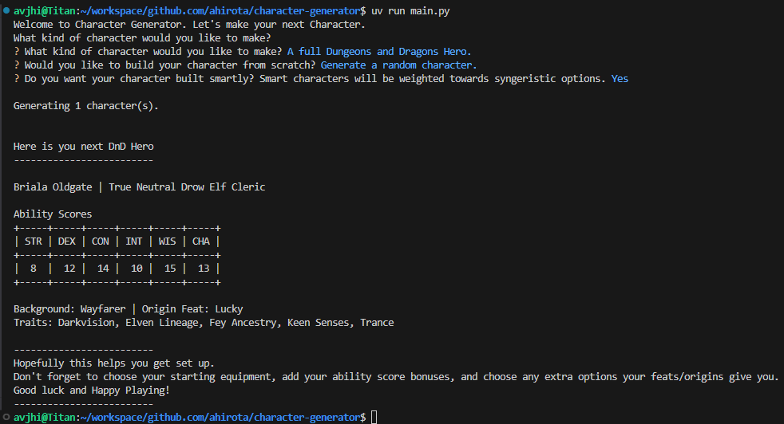

# Character Generator
Small Python Command-Line tool to generate a few options for your next character.

Currently supported themes/games:
- Random Fantasy Name
- Dungeons and Dragons

## Screenshot Example


## Features
Uses the `InquirerPy` package to drive an interactive series of command-line prompts.

Also uses the `PrettyTable` package to format the Ability Scores Table

### Name Generator
Reads from a JSON File and randomly selects a first name and last name from the list. Additional parameters can be chosen to filter and narrow down a name.

### Dungeons and Dragons Specific Setup
Utilizing JSON Files, the DnD Generator will output a few options for your next character with a few key details. Options for generating a "smart" base stat array are also available.

Character details will be formatted as below, and hopefully this can serve as a jumping off point for your next DnD Hero
```
{NAME} | {ALIGNMENT} {ANCESTRY SUBTYPE} {ANCESTRY} {CLASS}

Ability Scores
+-----+-----+-----+-----+-----+-----+
| STR | DEX | CON | INT | WIS | CHA |
+-----+-----+-----+-----+-----+-----+
|{STR}|{DEX}|{CON}|{INT}|{WIS}|{CHA}|
+-----+-----+-----+-----+-----+-----+

Background: {BACKGROUND_NAME} | Origin Feat: {BACKGROUND_FEAT}
Traits: {ANCESTRY_TRAITS}
```

## Running this Project
To run this project, please follow the steps below. Make sure you have the prerequisites and then follow the step by step

### Pre-requisites
You'll need `uv` to run this project. You can get it here:

https://github.com/astral-sh/uv?tab=readme-ov-file#installation

### Installation
To set up and run this project, follow these steps:

1. Clone this repository:
2. Navigate to the project directory: 
3. Install Dependencies: `uv sync`
4. Run the script: `uv run main.py`

## Questions/Comments/Concerns?
Feel free to reach out to me:
- Email: avjhirota@gmail.com
- Discord: @neinhearted

## Road Map
- [x] Refactor for Smaller Scope (Was a bit ambitious the first go around)
- [x] Class Picker/Generator
- [x] Origin Picker/Generator
- [x] Feat Picker/Generator
- [x] Submit to BootDev for Project Completion - This is the MVP
- [ ] Add DnD Hero "One Line Descriptor" based on character choices
- [ ] Add additional parameters for filtering and generating a name
- [ ] Additional Character Generators? Maybe one less demanding LOL